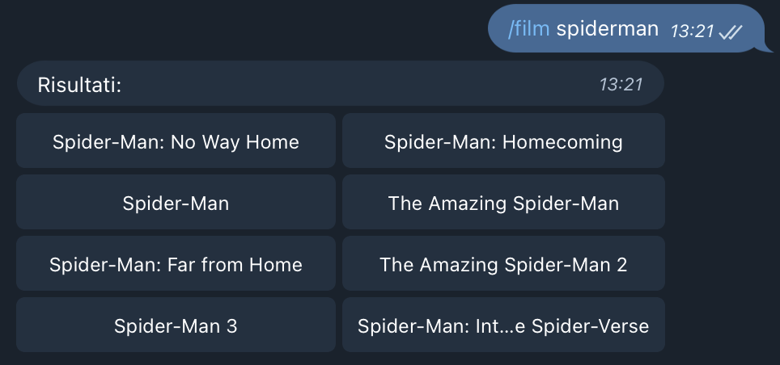
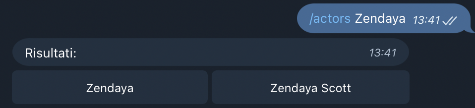

# [Movie scraper bot](https://t.me/movie_scraper_bot)

Semplice bot che permette di cercare informazioni riguardo a serie TV, 
film, attori e molto altro.
 
### Comandi
| Comando | Utilizzo                                 |
|---------|------------------------------------------|
| /actors | Cerca attori                             |
| /films  | Cerca film e serie tv                    |
| /usage  | Mostra il messaggio con i comandi        |

### Guida rapida alle tastiere
> 
>  
> Al comando `film` viene inviata una tastiera come la seguente: 
> bisogna cliccare il tasto corrispondente al film che si desiderava cercare.

 

>
>  
> Quando si clicca su un bottone, viene mandato il film con un'altra tastiera.

 

>
>  
> Cliccando una volta sui due bottoni della prima riga, dopo alcuni
> secondi appare una freccetta. Così facendo si può aprire una pagina web.
>  
> Le pagine contengono commenti strani e divertenti (`Crazy Comments`) e
> i principali attori coinvolti (`Top Cast`). Il primo bottone della seconda 
> linea, invece, contiene un link per aprire lo show direttamente nel sito 
> ufficiale, imdb.com. L'ultimo bottone, `Manda Link`, manda un link 
> che si può facilmente condividere.

 

>
>  
> Cliccando sul tasto `Top Cast` si apre una pagina con il nome e una foto 
> dell'attore. Cliccando sul nome è possibile ottenere ulteriori informazioni
> riguardo all'attore.

 

>
>  
> Stesso procedimento vale per la ricerca degli attori.

 

>
>  
> Anche gli attori hanno la loro tastiera, composta dai tasti `Biografia`, 
> che apre una pagina web contentente la biografia dell'attore, e il tasto
> `Ruoli Importanti`, che apre una lista di film in cui l'attore ha recitato.
> Poi c'è anche il tasto `Apri su Imdb.com` che apre la scheda dell'attore 
> sul sito ufficiale, e il tasto `Manda Link`, che svolge la medesima funzione
> che aveva con i film.

 

>
>  
> Similmente a come succede per i film, per gli attori si apre la 
> lista dei film in cui hanno recitato. Cliccando sul nome del film si possono
> ottenere ulteriori informazioni, sempre dal bot.
